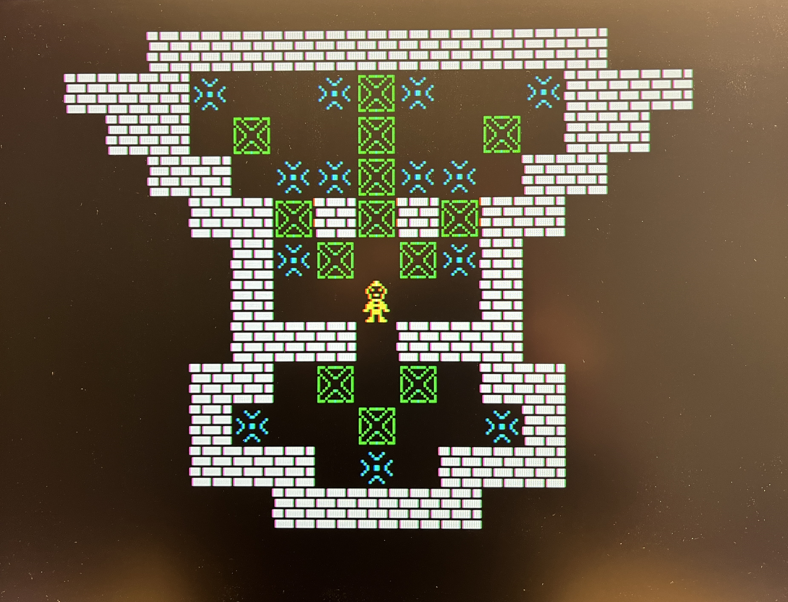

# Cerberus Sokoban

This sokoban clone runs on TheByteAttic Cerberus platform, a [Cerberus2080](https://github.com/TheByteAttic/CERBERUS2080), or the latest [Cerberus2100](https://github.com/TheByteAttic/CERBERUS2100) model with color support.

The [releases](https://github.com/envenomator/cerberus-sokoban/releases) folder contains multiple executable binary files, each with an included set of Sokoban levels.

### CPU mode
All binaries are in Z80 code, requiring the Z80 te be active on the Cerberus.

### Screenshots
Level selector:

One of the 'sasquatch' levels:
